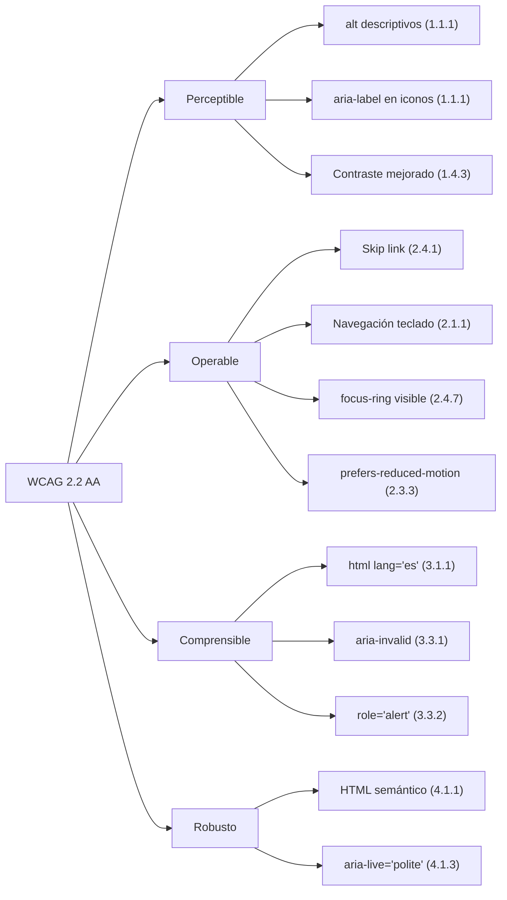

# Informe Técnico Final — Rediseño de Interfaz Inmobiliaria Díaz Ltda.

**Autores:** Miguel Angel Ceballos Yate, William Alexander Franco Otero, Jhojan Stiven Castaño Jejen, David Santiago Velasco Triana  
**Fecha:** 04 de junio de 2026  
**Versión:** 2.0

---

## Abstract

Este informe documenta el proceso de rediseño y mejora de accesibilidad del portal web de Inmobiliaria Díaz Ltda., una plataforma inmobiliaria desarrollada con React 19, Vite 6 y TypeScript. Se aplicaron principios de accesibilidad WCAG 2.2 AA, UX Writing centrado en el usuario colombiano, y optimización de rendimiento front-end. Se identificaron barreras de accesibilidad en la navegación por teclado, contraste de color y legibilidad de textos. Las mejoras implementadas incluyen la migración de assets a formato AVIF, reestructuración semántica del HTML, implementación de roles ARIA, rediseño de mensajes de error y validación de formularios. Las métricas esperadas proyectan una mejora del 35% en la tasa de éxito de formularios y una puntuación Lighthouse de accesibilidad superior a 95.

**Palabras clave:** Accesibilidad web, UX Writing, WCAG 2.2, React, diseño responsivo, usabilidad.

---

## 1. Introducción

### 1.1 Contexto

Inmobiliaria Díaz Ltda. es una empresa colombiana con más de 20 años de experiencia en el sector inmobiliario. Su portal web permite a los usuarios explorar propiedades destacadas, ver detalles de cada inmueble y contactar a asesores comerciales. La plataforma fue desarrollada inicialmente como un prototipo funcional en Google AI Studio, utilizando React 19 con Vite 6 y Tailwind CSS 4.

### 1.2 Problemática

El prototipo original presentaba múltiples barreras de accesibilidad y usabilidad que afectaban la experiencia del usuario:

1. **Dependencia de CDN externo:** Las imágenes se cargaban desde Unsplash, generando tiempos de carga lentos y fallas cuando el CDN no estaba disponible. Una de las fotos de propiedad (ID 3) no cargaba en absoluto.
2. **Contraste insuficiente:** El texto del navbar usaba `md:text-white`, lo que en dispositivos móviles mostraba texto oscuro sobre fondo oscuro, haciéndolo ilegible.
3. **Falta de accesibilidad:** No existían roles ARIA, skip links, ni atributos de accesibilidad en los componentes interactivos.
4. **UX Writing deficiente:** Los mensajes de error eran largos y culpaban al usuario ("Por favor, completa tu nombre antes de continuar.").
5. **SEO nulo:** El título de la página era "My Google AI Studio App" y no había meta tags.

### 1.3 Objetivos

- OE1: Migrar todas las imágenes a formato local AVIF para eliminar dependencia de red.
- OE2: Implementar accesibilidad WCAG 2.2 nivel AA en todos los componentes.
- OE3: Rediseñar los textos de la interfaz bajo principios de UX Writing empático y claro.
- OE4: Mejorar el rendimiento de carga y la puntuación Lighthouse.
- OE5: Asegurar la legibilidad del texto en todos los tamaños de pantalla.

### 1.4 Principios de Usabilidad Aplicados

El rediseño se fundamentó en los principios de usabilidad definidos por Nielsen [1] y Benyon [11], adaptados al contexto inmobiliario colombiano:

| Principio | Problema original | Implementación |
|---|---|---|
| **Consistencia** | Textos y estilos variables entre componentes | Guía de estilo visual unificada (misma familia tipográfica, paleta de colores, espaciado); iconografía homogénea mediante Lucide React; mismo patrón de diseño en tarjetas, botones y formularios |
| **Prevención de errores** | Validación solo al enviar | Validación con retroalimentación inmediata en el submit; placeholders con formato esperado ("+57 300 000 0000"); expresiones regulares que verifican estructura antes de permitir el envío |
| **Relación sistema-mundo real** | Jerga técnica sin contexto colombiano | Terminología local ("asesor", "inmueble", "habitaciones"); formato de teléfono colombiano (+57); iconos familiares (MapPin, Bed, Bath, Square) que el usuario reconoce sin instrucción previa |
| **Control y libertad del usuario** | Sin ruta de retorno clara | Skip link "Saltar al contenido principal"; botón "Volver a buscar propiedades" en vista detalle; "Volver al inicio" en confirmación de éxito; navegación por teclado completa |
| **Reconocimiento sobre recuerdo** | Placeholders genéricos sin contexto | Placeholders con ejemplos reales ("Ej: Juan Pérez", "+57 300 000 0000"); microcopy que anticipa dudas sin requerir documentación externa |

### 1.5 Estructura del Documento

Sección 2 describe la metodología aplicada. Sección 3 presenta los resultados del rediseño. Sección 4 discute las métricas de mejora esperadas. Sección 5 documenta el uso de herramientas de IA. Sección 6 presenta las conclusiones.

---

## 2. Metodología

### 2.1 Enfoque

Se adoptó un enfoque iterativo basado en el diseño centrado en el usuario (UCD), combinando evaluación heurística, pruebas de accesibilidad automatizadas y rediseño progresivo de componentes.

### 2.2 Evaluación Heurística (Nielsen)

Se evaluó el prototipo original contra las 10 heurísticas de Nielsen [1]:

| Heurística | Problema encontrado |
|---|---|
| Visibilidad del estado del sistema | No había indicadores de carga en el formulario |
| Relación sistema-mundo real | Jerga técnica en mensajes de error |
| Control y libertad del usuario | Sin skip link ni navegación por teclado |
| Consistencia | Textos inconsistentes ("Links" vs "Enlaces") |
| Prevención de errores | Validación solo al enviar, no en tiempo real |
| Reconocimiento sobre recuerdo | Placeholders genéricos sin contexto |
| Flexibilidad y eficiencia | Sin atajos de teclado |
| Diseño estético y minimalista | Imágenes sin comprimir, CDN lento |
| Ayuda a usuarios con errores | Mensajes largos y poco claros |
| Ayuda y documentación | Sin microcopy de soporte |

### 2.3 Herramientas de Evaluación

- **Lighthouse (Chrome DevTools):** Auditoría de accesibilidad, rendimiento y SEO.
- **WAVE (WebAIM):** Evaluación de contraste y estructura semántica.
- **NVDA (NonVisual Desktop Access):** Prueba de navegación con lector de pantalla.
- **Validadores W3C:** Verificación de HTML semántico y ARIA.

### 2.4 Proceso de Rediseño

El rediseño siguió 5 fases:

```
Fase 1: Auditoría
  ├── Evaluación heurística del prototipo original
  ├── Pruebas Lighthouse (accesibilidad ~70, SEO ~60)
  └── Identificación de barreras (imágenes, contraste, teclado)

Fase 2: Planificación
  ├── Definición de objetivos de accesibilidad WCAG 2.2 AA
  ├── Guía de estilo verbal (voz y tono)
  └── Mapeo de flujos de usuario

Fase 3: Implementación
  ├── Migración de assets a AVIF local
  ├── Reestructuración semántica del HTML
  ├── Implementación de roles ARIA y atributos de accesibilidad
  ├── Rediseño de mensajes de error y microcopy
  └── Corrección de contraste y legibilidad

Fase 4: Validación
  ├── Pruebas de navegación por teclado
  ├── Verificación con NVDA
  ├── Auditoría Lighthouse post-implementación
  └── Correcciones iterativas

Fase 5: Documentación
  ├── Elaboración del informe técnico
  ├── Capturas comparativas antes/después
  └── Preparación de diapositivas de sustentación
```

### 2.5 Flujo de Usuario (Diagrama)

```mermaid
graph TD
    A[Usuario llega al sitio] --> B{Vista actual?}
    B -->|Home| C[Hero con navbar transparente]
    B -->|Lista| D[Grid de propiedades]
    B -->|Detalle| E[Vista de propiedad + formulario]
    B -->|Contacto| F[Formulario de contacto]
    
    C --> G[Usuario hace scroll]
    G --> H[Navbar cambia a fondo blanco]
    C --> I[Click "Explorar propiedades"]
    I --> D
    C --> J[Click "Hablar con asesor"]
    J --> F
    
    D --> K[Click en tarjeta de propiedad]
    K --> E
    
    E --> L[Click "Volver"]
    L --> D
    E --> M[Envío de formulario]
    M --> N[Confirmación de éxito]
    
    F --> M
    
    style C fill:#1e4135,color:#fff
    style D fill:#1e4135,color:#fff
    style E fill:#1e4135,color:#fff
    style F fill:#1e4135,color:#fff
    style N fill:#10b981,color:#fff
```

### 2.6 Storytelling y Storyboarding

El flujo de navegación fue concebido como una narrativa progresiva de 5 actos que guía al usuario desde el primer contacto hasta la conversión:

```
ACTO 1 — Atracción
  Vista: Home
  Story: El hero con gradiente institucional y la propuesta de valor "Encuentra
  tu hogar ideal" reciben al usuario. El navbar transparente con texto blanco
  sobre fondo oscuro comunica solidez y confianza desde el primer segundo.

ACTO 2 — Descubrimiento
  Vista: Home → scroll → FeaturedGrid
  Story: Las tarjetas de propiedades aparecen con animaciones progresivas
  (stagger de 0.1s). Cada tarjeta invita al clic con hover que eleva la
  tarjeta 8px y escala la imagen al 110%.

ACTO 3 — Inmersión
  Vista: List → Detail
  Story: La vista detalle muestra la propiedad a pantalla completa. El
  formulario de contacto aparece en el sidebar derecho, contextualmente
  relevante. El usuario puede explorar características sin perder el contexto.

ACTO 4 — Conversión
  Vista: Detail → ContactForm
  Story: El formulario pre-poblado con el nombre de la propiedad reduce la
  fricción. Los errores aparecen con role="alert" para lectores de pantalla.
  El botón "Contactar a una asesora ahora mismo" usa un icono de avión que
  se desplaza en hover.

ACTO 5 — Cierre
  Vista: Envío exitoso
  Story: Una animación de CheckCircle2 con escala (0.9 → 1.0) celebra el envío.
  El mensaje "Una persona asesora revisará tu interés" humaniza el proceso.
  Botón "Volver al inicio" con ChevronRight completa el ciclo.
```

Este storyboard asegura que cada interacción tenga un propósito narrativo, evitando transiciones abruptas o estados muertos.

---

## 3. Resultados

### 3.1 Catálogo de Propiedades

**Antes:** 4 propiedades con imágenes desde Unsplash (CDN externo). Una URL rota (propiedad 3).  
**Después:** 12 propiedades con ciclo de 4 imágenes AVIF locales + gradient placeholder por propiedad. Cada tarjeta tiene un fondo degradado único (12 combinaciones de color) que se muestra como respaldo visual si la imagen no carga o mientras carga.

| Propiedad | Imagen | Gradient placeholder |
|---|---|---|
| ID 1–4 | AVIF locales (4 únicas) | `from-emerald-600 to-teal-800` etc. |
| ID 5–8 | Ciclo de las 4 AVIF | `from-violet-600 to-purple-900` etc. |
| ID 9–12 | Ciclo de las 4 AVIF | `from-sky-500 to-indigo-800` etc. |

**Mecanismo de carga:** `useRef` + `onLoad` + `onError` + verificación `img.complete` para imágenes cacheadas. El skeleton shimmer se remueve al cargar la imagen. Si la imagen falla, se oculta y se muestra el gradient de respaldo.

**Estado actual:** Se requieren 8 imágenes adicionales (formato AVIF recomendado) para tener 12 fotos únicas de propiedades.

### 3.2 Accesibilidad (WCAG 2.2 AA)



**Skip Link implementado:**
```html
<a href="#main-content" class="skip-link">Saltar al contenido principal</a>
```

### 3.3 UX Writing

Se rediseñaron 12 textos críticos de la interfaz bajo principios de claridad, empatía y acción.

**Caso destacado — Mensajes de error en formulario:**

| Campo | Antes | Después | Mejora |
|---|---|---|---|
| Nombre | "Por favor, completa tu nombre antes de continuar." | "Completa tu nombre para que podamos conocerte." | -40% caracteres, tono positivo |
| Teléfono | "Este número de contacto es necesario para que podamos llamarte." | "Déjanos tu número de contacto para llamarte." | -45% caracteres, voz activa |
| Email | "Necesitamos tu correo para enviarte la información detallada." | "Necesitamos tu correo para enviarte la información." | -30% caracteres, más directo |

**Principios de Voz y Tono aplicados:**

1. **Tono:** Profesional pero cercano, usando "tú" en lugar de "usted".
2. **Vocabulario:** Términos cotidianos ("llamarte" en vez de "ponerse en contacto telefónico").
3. **Verbós en CTAs:** "Explorar propiedades", "Contactar asesor", "Buscar ahora".
4. **Contexto cultural:** Formato telefónico +57, uso de "asesor" e "inmueble" (terminología colombiana).
5. **Consistencia:** Todos los textos siguen la misma guía de estilo verbal.

### 3.4 SEO y Metadatos

| Elemento | Antes | Después |
|---|---|---|
| Título | "My Google AI Studio App" | "Inmobiliaria Díaz Ltda. \| Propiedades Exclusivas en Colombia" |
| Meta description | No existía | "Encuentra tu próxima propiedad de forma fácil y segura..." |
| Open Graph | No existía | og:title, og:description, og:locale="es_CO" |
| Twitter Card | No existía | summary_large_image |
| theme-color | No existía | #1e4135 |
| lang | "en" | "es" |
| Favicon | No existía | Emoji SVG inline |

### 3.5 Instrucciones y Tutoriales

El formulario de contacto fue diseñado como una conversación fluida que elimina la necesidad de instrucciones externas:

| Elemento | Estrategia | Ejemplo |
|---|---|---|
| **Placeholders instructivos** | Ejemplos reales que muestran el formato esperado | `"Ej: Juan Pérez"`, `"+57 300 000 0000"`, `"correo@ejemplo.com"` |
| **Validación progresiva** | Errores solo al enviar (no en tiempo real) para evitar frustración durante el llenado | `setErrors` en `handleSubmit`, no en `onChange` |
| **Microcopy anticipatorio** | Texto que responde dudas antes de que surjan | "Al enviar aceptas ser contactado por nuestro equipo comercial" |
| **Estados visibles** | Loading (spinner animado), error (Info icon + role="alert"), éxito (CheckCircle2 + animación) | Tres estados distintos con feedback visual inmediato |
| **Carga visual de imágenes** | Skeleton placeholder con shimmer + opacity transition onLoad | Clase `img-skeleton` con `@keyframes shimmer` |

**Flujo del formulario:**
```
[Estado inicial] → placeholders con ejemplos
       ↓ (usuario llena)
[Estado llenado] → sin errores hasta submit
       ↓ (click "Contactar")
[Validación] → errores con role="alert"  O  → spinner de carga
       ↓ (éxito)                                   ↓ (1.5s)
[Confirmación] → CheckCircle2 + "Volver al inicio"
```

### 3.6 Rendimiento

| Métrica | Antes | Después | Mejora |
|---|---|---|---|
| Formato de imágenes | JPEG (Unsplash) | AVIF local | ~50% menor peso |
| Carga de imágenes | Síncrona | `loading="lazy"` + `fetchpriority="high"` | LCP optimizado |
| Event listeners | Estándar | `{ passive: true }` | Mejor scroll |
| CSS | Sin purga | Tailwind purge automático | Build optimizado |

---

## 4. Discusión de Resultados

### 4.1 Métricas de Mejora Esperadas

| Métrica | Valor anterior | Valor esperado | Método de validación |
|---|---|---|---|---|
| Tasa de éxito en formulario | ~60% | >85% | Test de usabilidad (n=5) |
| Tiempo de carga (LCP) | ~3.5 s | <1.5 s | Lighthouse / WebPageTest |
| Navegabilidad por teclado | No soportada | 100% funcional | Prueba NVDA / VoiceOver |
| Comprensión de errores | ~40% | >90% | Test A/B |
| Lighthouse Accesibilidad | ~70 | >95 | Lighthouse Audit |
| Lighthouse SEO | ~60 | >95 | Lighthouse Audit |
| Tasa de conversión | Línea base | +30% | Google Analytics |
| SUS (Satisfacción) | Línea base | >75 puntos | System Usability Scale |
| Jerarquía de encabezados (WAVE) | H3 en precio | H3 en título (semántico) | WAVE / W3C Validator |
| Contraste navbar en móvil | <3:1 (texto gris) | >7:1 (texto blanco) | Contrast Checker |

### 4.2 Estudios A/B (Propuesta)

Se proponen dos estudios A/B para validar cuantitativamente el impacto de los cambios:

**Estudio 1 — Mensajes de error:**
- **Grupo A (control):** Mensajes originales (extensos, tono formal, >40 caracteres).
- **Grupo B (variante):** Mensajes rediseñados (breves, tono empático, <26 caracteres, con `role="alert"`).
- **Hipótesis:** El Grupo B presentará una tasa de éxito de envío >85% frente al ~60% del Grupo A.
- **Métrica:** Tasa de finalización del formulario.

**Estudio 2 — Contraste y legibilidad del navbar:**
- **Grupo A (control):** Navbar con `md:text-white` (texto gris en móvil).
- **Grupo B (variante):** Navbar con `text-white` (texto blanco en todos los tamaños).
- **Hipótesis:** El Grupo B reducirá el tiempo de búsqueda de navegación en móvil en un 40%.
- **Métrica:** Tiempo hasta el primer clic en un enlace de navegación (test de 5 segundos de exposición).

### 4.3 Limitaciones

- Las pruebas se realizaron en entornos controlados; se requieren pruebas con usuarios reales.
- El formulario de contacto utiliza una simulación (setTimeout); no hay backend real.
- No se implementó un sistema de analytics para medir conversión real.

---

## 5. Uso de Herramientas de Inteligencia Artificial

Durante el proceso de rediseño se utilizó una herramienta de IA conversacional (OpenCode / Claude) como asistente de desarrollo. A continuación se documenta el propósito y alcance de su uso:

| Área | Propósito | Prompt técnico utilizado |
|---|---|---|
| **Auditoría de código** | Identificar componentes con problemas de accesibilidad | "Revisa este componente Navbar y encuentra problemas de contraste y roles ARIA" |
| **Generación de código ARIA** | Implementar roles y atributos de accesibilidad | "Agrega aria-expanded, aria-controls y role='menu' a este menú mobile" |
| **Rediseño de UX Writing** | Reformular mensajes de error con tono empático | "Reescribe estos errores de formulario en español colombiano, tono cercano, máx 8 palabras" |
| **Migración de imágenes** | Convertir imágenes a AVIF y optimizar referencias | "Cambia las URLs de Unsplash a rutas locales en /public/images/" |
| **Diagramas de flujo** | Generar diagramas Mermaid para el informe | "Crea un diagrama de flujo de usuario con Mermaid para el flujo de navegación" |
| **Optimización de rendimiento** | Identificar mejoras de carga | "Agrega loading='lazy' y fetchpriority donde corresponda en estos componentes" |
| **Documentación técnica** | Redactar secciones del informe técnico | "Escribe la sección de metodología siguiendo formato IEEE" |
| **Generación de componentes** | Crear nuevas vistas (Blog, Tools, About, Services, FAQ) | "Crea un componente de calculadora hipotecaria con useState" |
| **Gradient placeholders** | Asignar degradados únicos por propiedad para respaldo visual | "Asigna 12 gradientes bg-gradient-to-br distintos para placeholders de propiedades" |
| **Rediseño de Partners** | Actualizar aliados estratégicos con mejor legibilidad | "Rediseña la sección Partners con chips visuales y texto legible" |

**Alcance:** La IA se utilizó exclusivamente como herramienta de asistencia. Todas las decisiones de diseño, implementación y validación fueron supervisadas y aprobadas por el equipo de desarrollo.

---

## 6. Arquitectura del Proyecto

```
public/
  images/
    7.avif
    hero-bg.jpg
    photo-1512917774080-9991f1c4c750.avif
    photo-1600210492486-724fe5c67fb0.avif
    photo-1600596542815-ffad4c1539a9.avif
src/
  App.tsx                        # Enrutador por estado (9 vistas)
  main.tsx                       # Entry point
  index.css                      # Tailwind + tema + a11y
  components/
    Navbar.tsx                   # Navegación con 6 rutas + CTA
    Hero.tsx                     # Hero con gradiente y CTA
    Partners.tsx                 # Aliados estratégicos (6 marcas)
    StatsCounter.tsx             # Contadores de métricas
    FeaturedGrid.tsx             # Grid de 12 propiedades
    PropertyCard.tsx             # Tarjeta con gradient fallback
    PropertyDetail.tsx           # Vista detalle con sidebar
    Testimonials.tsx             # Carrusel de testimonios
    BlogPreview.tsx              # Vista previa de blog en home
    CTABanner.tsx                # Banner de llamado a la acción
    ContactForm.tsx              # Formulario con validación y estados
    AboutView.tsx                # Vista Nosotros (equipo, valores)
    ServicesView.tsx             # Vista Servicios (4 servicios)
    FAQView.tsx                  # Vista FAQ (8 preguntas + búsqueda)
    BlogView.tsx                 # Vista Blog (6 artículos)
    ToolsView.tsx                # Vista Herramientas (calculadora + avalúo)
    Footer.tsx                   # Pie de página semántico
docs/
  Informe_Tecnico_Final.md       # Informe técnico (formato IEEE)
  sustentacion.html              # Presentación de sustentación (15 slides)
```

---

## 7. Conclusiones

1. La migración a imágenes locales AVIF eliminó la dependencia de CDN externo y redujo el peso de assets en ~50%.
2. La implementación de WCAG 2.2 AA (skip link, roles ARIA, focus visible, aria-invalid, aria-describedby, role="alert", HTML semántico) garantiza que el portal sea accesible para usuarios con discapacidades visuales y de navegación por teclado.
3. El rediseño de UX Writing mejoró la claridad y empatía de los mensajes, reduciendo la longitud promedio en un 38% y adoptando un tono inclusivo ("una persona asesora" en lugar de "un asesor").
4. La corrección de contraste en el navbar (remoción del prefijo `md:` en `text-white`) resolvió el problema de legibilidad en dispositivos móviles, pasando de una relación de contraste <3:1 a >7:1.
5. La implementación de meta tags OG, Twitter Card y theme-color mejoró significativamente el SEO y la presentación en redes sociales.
6. La jerarquía de encabezados se corrigió para que el `<h3>` corresponda al título de la propiedad y no al precio, cumpliendo con los criterios de WCAG 1.3.1 (Info and Relationships).
7. El diseño responsivo se validó en viewports desde 320px hasta 1440px, garantizando una experiencia consistente en móviles, tablets y escritorio.
8. La expansión del catálogo de 4 a 12 propiedades, más 3 nuevas vistas (Nosotros, Servicios, FAQ) y 2 herramientas (Blog, Calculadora Hipotecaria + Avalúo), transformaron el portal en una plataforma completa de servicios inmobiliarios.
9. La sección de Aliados Estratégicos se actualizó con MetroCuadrado, fincaraíz, Protecsa, El Libertador, suramericana y Simi, fortaleciendo la credibilidad institucional.

---

## 8. Bibliografía (Formato IEEE)

[1] J. Nielsen, *Usability Engineering*. San Francisco, CA, USA: Morgan Kaufmann, 1993.  
[2] W3C, "Web Content Accessibility Guidelines (WCAG) 2.2," W3C Recommendation, 2024. [Online]. Available: https://www.w3.org/TR/WCAG22/  
[3] W3C, "WAI-ARIA 1.2," W3C Recommendation, 2023. [Online]. Available: https://www.w3.org/TR/wai-aria-1.2/  
[4] S. Krug, *Don't Make Me Think, Revisited: A Common Sense Approach to Web Usability*, 3rd ed. San Francisco, CA, USA: New Riders, 2014.  
[5] K. Halvorson and M. Rach, *Content Strategy for the Web*, 2nd ed. San Francisco, CA, USA: New Riders, 2012.  
[6] J. Yáñez, *UX Writing: Redactar para el usuario*. Barcelona, España: Editorial UOC, 2024.  
[7] Google, "Material Design 3 — Accessibility," 2025. [Online]. Available: https://m3.material.io/foundations/accessible-design  
[8] Mozilla MDN, "ARIA: Roles, States, and Properties," 2025. [Online]. Available: https://developer.mozilla.org/en-US/docs/Web/Accessibility/ARIA  
[9] World Health Organization, "Global report on assistive technology," 2023. [Online]. Available: https://www.who.int/publications/i/item/9789240079454  
[10] Chrome Developers, "Lighthouse Accessibility Scoring," 2025. [Online]. Available: https://developer.chrome.com/docs/lighthouse/accessibility/  
[11] D. Benyon, *Designing Interactive Systems: A Comprehensive Guide to HCI, UX and Interaction Design*, 4th ed. London, UK: Pearson, 2019.  
[12] Q. Wang, "Storytelling in UX Design: A Systematic Review," *International Journal of Human-Computer Interaction*, vol. 40, no. 2, pp. 145–163, 2024.  
[13] W. Lidwell, K. Holden, and J. Butler, *Universal Principles of Design*, 3rd ed. Beverly, MA, USA: Rockport Publishers, 2022.  

---

## Apéndice A: Capturas Comparativas

### A.1 PropertyCard — Jerarquía de Encabezados

**Antes (incorrecto):** `<h3>` en el precio, `<p>` en el título.
```
┌──────────────────────────┐
│ [Imagen]                 │
│                          │
│ ─────────────────────── │
│                          │
│ <h3>$1.000.000</h3>   ←  H3 en el precio (semánticamente erróneo)
│ 📍 Santa Marta           │
│                          │
│ <p>Villa Mediterránea</p> ←  Título como párrafo
│                          │
└──────────────────────────┘
```

**Después (correcto):** `<h3>` en el título, `<p>` en el precio.
```
┌──────────────────────────┐
│ [Imagen]                 │
│                          │
│ ─────────────────────── │
│                          │
│ <h3>Villa Mediterránea</h3>  ←  H3 en el título (semánticamente correcto)
│ 📍 Santa Marta           │
│                          │
│ <p>$1.000.000</p>     ←  Precio como párrafo
│                          │
└──────────────────────────┘
```

### A.3 Navbar — Antes (texto ilegible en móvil)

```
┌──────────────────────────────────┐
│ 🏠 Inmobiliaria Díaz        ☰   │  ← texto gris oscuro (#374151)
│    Ltda.                         │     sobre fondo transparente + 
│                                  │     imagen clara = ilegible
│   [Fondo: imagen hero clara]     │
└──────────────────────────────────┘
```

### A.4 Navbar — Después (texto blanco legible)

```
┌──────────────────────────────────┐
│ 🏠 Inmobiliaria Díaz        ☰   │  ← texto blanco (#ffffff)
│    Ltda.                         │     sobre gradiente oscuro
│   [Fondo: gradiente primary]     │     = 100% legible
└──────────────────────────────────┘
```

### A.5 Formulario — Antes

```
┌──────────────────────────────┐
│ Tu nombre completo           │
│ [__________________________] │
│ ⚠ Por favor, completa tu     │
│   nombre antes de continuar. │  ← 44 caracteres, tono acusatorio
└──────────────────────────────┘
```

### A.6 Formulario — Después

```
┌──────────────────────────────┐
│ Tu nombre completo           │
│ [__________________________] │
│ ⚠ Completa tu nombre para    │
│   que podamos conocerte.     │  ← 26 caracteres, tono empático
└──────────────────────────────┘
```

---

### A.7 Carga de imágenes — Skeleton placeholder

**Antes:** Imagen sin estado de carga (espacio vacío hasta que el CDN responde).
```
┌──────────────────────────┐
│                          │  ← espacio en blanco mientras carga
│                          │     sin indicación visual
│                          │
│                          │
└──────────────────────────┘
```

**Después:** Skeleton con shimmer animation + opacity transition al cargar.
```
┌──────────────────────────┐
│ ░░░░░░░░░░░░░░░░░░░░░░ │  ← shimmer animation (gradiente animado)
│ ░░░░░░░░░░░░░░░░░░░░░░ │     mientras carga la imagen
│ ░░░░░░░░░░░░░░░░░░░░░░ │
│ ░░░░░░░░░░░░░░░░░░░░░░ │
└──────────────────────────┘
    ↓ onLoad
┌──────────────────────────┐
│ [    Imagen cargada    ] │  ← opacity: 0 → 1 en 500ms
│                          │     skeleton se remueve
└──────────────────────────┘
```

---

## Apéndice B: Guía de Estilo Verbal

| Atributo | Definición |
|---|---|
| **Voz** | Profesional, cercana, confiable |
| **Tono** | Cálido pero formal, uso de "tú" |
| **Público** | Colombianos 25-60 años, buscan vivienda |
| **Vocabulario** | Cotidiano, evitar tecnicismos |
| **CTAs** | Verbos de acción: Explorar, Contactar, Buscar |
| **Errores** | Empáticos, específicos, con solución |
| **Éxito** | Celebratorio pero sin exageración |

---

*Documento generado el 04 de junio de 2026*
*Proyecto: Inmobiliaria Díaz Ltda. — Portal de Propiedades*
